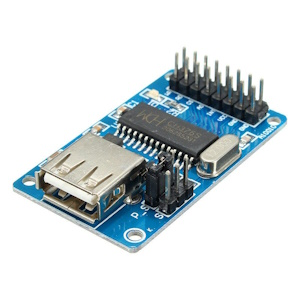
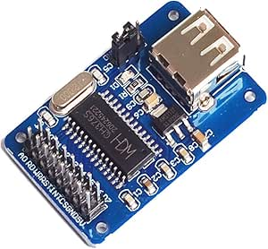

# MSX-USB V5 PCBs

There are two folders for the PCBs abecause there are different types of CH376 modules available. Depending on the module you have, you’ll need to use a specific version of the PCB. Compare the signals of your module with those on the PCBs to ensure you select the correct one.

## CHS376 Modules
### CH376S Module Type 1

The type 1 module can be recognized by the presence of a 6 position header on the left side of the module. The main header located at the bottom of the module has a configuration with the data signals located on the lower pins and the control signals on the upper pins.

The PCB that is suitable for the CH376S Module Type 1 has the appropriated signals configured appropriately to support the module. 

### CH376S Module Type 2

The type 2 module can be recognized by the presence of a 3 position header on the left side of the module. The main header located at the bottom of the module has a configuration with the data signals located on the upper pins and the control signals on the lower pins.

The PCB that is suitable for the CH376S Module Type 2 has the appropriated signals configured appropriately to support the module. 

**Very important:** The MSX-USB project requires modules with the CH376S firmware with at least version 0x43 (Version 3). If you have a CH376 module with a CH376S chip with versions 0x41 or 0x42 the drivers will not work. You can check the version of the firmware by issuing a CMD_GET_IC_VER command to the CH376S chip. Also some of the drivers display the version of the CH376S firmware when they are loaded.

## PCBs

Two versions of the PCB were created to support the two different modules on sale at this moment. You can download the Gerber files for each version of the PCB from the folders below.

* [CH376S Module Type 1](kicad/CH276S-Type1)
* [CH376S Module Type 2](kicad/CH276S-Type2)

## BOM

### [CH376S Module Type 1](kicad/CH276S-Type1)

| References | Value    | Footprint | Quantity | Link |
|------------|----------|-----------|----------|------|
| C2, C3, C4 | 0.1 uF   | C_0805_2012Metric_Pad1.18x1.45mm_HandSolder    | 3        |AliExpress|
| C1         | 100 uF   | CP_Radial_D5.0mm_P2.50mm                       | 1        |AliExpress|
| R1         | 4K7      | R_0805_2012Metric_Pad1.20x1.40mm_HandSolder    | 1        |AliExpress|
| U2         | EPM7064STC44-7 | QFP80P1200X1200X120-44N                  | 1        |AliExpress|
| U3         | M29F400M | SO44                                           | 1        |AliExpress|
| SW1        | SK12D07VG4 | SK12D07VG4                                   | 1        |AliExpress|
| EDG1       | MSX_CON  | msx-con-MSXCART                                | 1        |AliExpress|
| J1         | AVR-JTAG-10 | PinHeader_2x05_P2.54mm_Vertical             | 1        |AliExpress|
| J2         | Conn_02x08_Odd_Even | PinHeader_2x08_P2.54mm_Vertical     | 1        |AliExpress|
| U4         | CH376S   | CH376S   type 1                                | 1        |AliExpress|

### [CH376S Module Type 2](kicad/CH276S-Type2)

| References | Value    | Footprint | Quantity | Link |
|------------|----------|-----------|----------|------|
| C2, C3, C4 | 0.1 uF   | C_0805_2012Metric_Pad1.18x1.45mm_HandSolder    | 3        |AliExpress|
| C1         | 100 uF   | CP_Radial_D5.0mm_P2.50mm                       | 1        |AliExpress|
| R1         | 4K7      | R_0805_2012Metric_Pad1.20x1.40mm_HandSolder    | 1        |AliExpress|
| U2         | EPM7064STC44-7 | QFP80P1200X1200X120-44N                  | 1        |AliExpress|
| U3         | M29F400M | SO44                                           | 1        |AliExpress|
| SW1        | SK12D07VG4 | SK12D07VG4                                   | 1        |AliExpress|
| EDG1       | MSX_CON  | msx-con-MSXCART                                | 1        |AliExpress|
| J1         | AVR-JTAG-10 | PinHeader_2x05_P2.54mm_Vertical             | 1        |AliExpress|
| J2         | Conn_02x08_Odd_Even | PinHeader_2x08_P2.54mm_Vertical     | 1        |AliExpress|
| U4        | CH376S   | CH376S   type 2                                 | 1        |AliExpress|

## CPLD

The CPLD code for the MSX-USB v5 can be found in the [cpld](cpld) folder. The code is written in Verilog and can be compiled using the Quartus software from Intel. The code is compatible with the EPM7064STC44-10 CPLD chip.

## License

This work is licensed under a [Creative Commons Attribution-NonCommercial-ShareAlike 4.0 International License](http://creativecommons.org/licenses/by-nc-sa/4.0/).

* If you remix, transform, or build upon the material, you must distribute your contributions under the same license as the original.
* You may not use the material for commercial purposes.
* You must give appropriate credit, provide a link to the license, and indicate if changes were made. You may do so in any reasonable manner, but not in any way that suggests the licensor endorses you or your use.

**ATTENTION**

This project was made for the retro community and not for commercial purposes. So only retro hardware forums and individual people can build this project.

THE SALE OF ANY PART OF THIS PROJECT WITHOUT EXPRESS AUTHORIZATION IS PROHIBITED!

